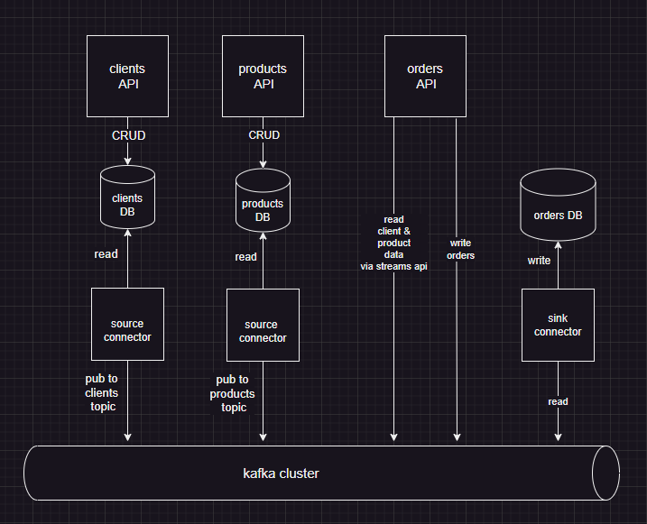

## About
In current PoC we build a naive event driven architecture (EDA) with the goal to explore Kafka and popular patterns of interacting with it

### high level view


#### Outline
- use source connectors to propagate DB changes (aka CDC)
- use kafka stream API to look up product and client data (ad hoc). Orders API can be scaled out trivially, just by increasing the number of instances thanks to Kafka stream API 
- use sink connector to track places orders


## to run locally 

#### to start/stop:
```
cd ./scripts && start.sh
cd ./scripts && stop.sh
```
#### check kafka cluster
- localhost:9021

#### check database via Adminer tool
```
localhost:8081
```
 

#### post test messages (events) to kafka
```
  cd ./scripts/console-client && ./pub-topic-message.sh topic_name key:value

```

#### quickly check available topics via consol
```
 cd ./scripts/console-client && ./get-topics.sh 
```

#### check available api ( swagger)
```
 localhost:80
```


### Prerequisites
- docker compose
- jc
- curl
- bash
- ubuntu (or any debian linux)


### Known issues

- to run docker compose on ubuntu you may want to chown the socket docker uses as 

```
sudo chown $(whoami):$(whoami) /var/run/docker.sock

```


- debezium configuration process  takes time, so it may take running ./start.sh 2 times in a row to set up debezium connector  
- to run swagger in browser don't forget to install/enable CORS plugin